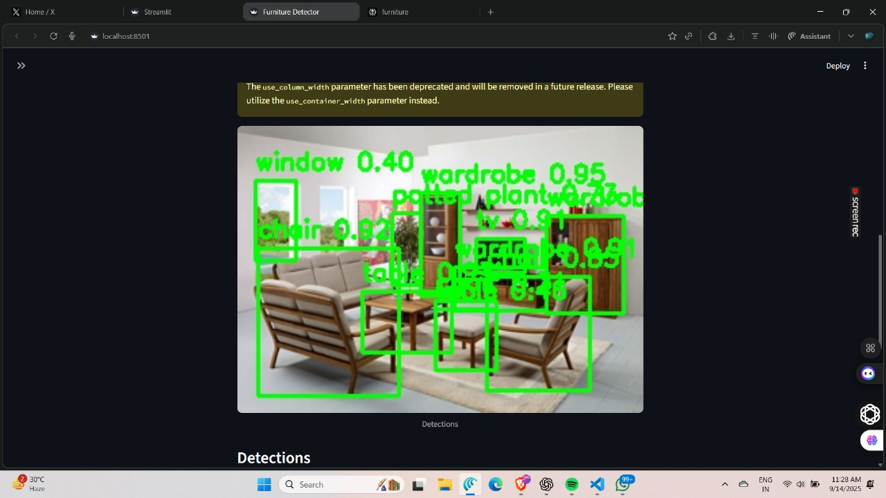

# Furniture Object Detection

A Python-based application for detecting and optionally removing furniture objects in images, built using a YOLO-based deep learning model. Offers both a FastAPI REST backend and an interactive Streamlit web interface.



---

## Table of Contents

- [Features](#features)
- [Demo](#demo)
- [Architecture](#architecture)
- [Setup](#setup)
  - [Requirements](#requirements)
  - [Installation](#installation)
  - [Model Weights](#model-weights)
- [Usage](#usage)
  - [Running the API](#running-the-api)
  - [API Endpoints](#api-endpoints)
  - [Running the Streamlit App](#running-the-streamlit-app)
- [Customization](#customization)
- [Project Structure](#project-structure)
- [License](#license)

---

## Features

- **Detects multiple types of furniture** in uploaded room images using a YOLO model.
- **REST API** (FastAPI) for programmatic access and integration.
- **Streamlit UI** for easy, no-code interaction and visualization.
- **Optional mask and remove**: Generate object masks or remove detected items via inpainting.
- **Confidence threshold**: Customizable detection sensitivity.
- **Downloadable results**: Get annotated images directly from the UI.

---

## Demo

1. **Upload a room photo via the web UI.**
2. **Run detection**: The app highlights detected furniture, outputs bounding box info, and allows mask/removal of objects.
3. **Download annotated image** or view detection details.

*(You can deploy locally or on a server!)*

---

## Architecture

- **Backend**: FastAPI app (`app.py`) serves a `/predict` endpoint for image inference using YOLO.
- **Frontend**: Streamlit app (`streamlit_app.py`) for uploading images, visualizing detections, and interacting with the API.
- **Model**: YOLO (Ultralytics) model, path configurable via `MODEL_PATH` environment variable.

---

## Setup

### Requirements

- Python 3.8+
- See `requirements.txt` for all dependencies:
  ```text
  fastapi
  uvicorn
  ultralytics
  opencv-python
  pillow
  requests
  streamlit
  pydantic
  ```

### Installation

1. **Clone the repository:**
   ```bash
   git clone https://github.com/KunjShah95/furniture-object-detection.git
   cd furniture-object-detection
   ```

2. **Install dependencies:**
   ```bash
   pip install -r requirements.txt
   ```

3. **(Optional) Set up a virtual environment:**
   ```bash
   python -m venv venv
   source venv/bin/activate  # On Windows: venv\Scripts\activate
   ```

### Model Weights

- By default, the app expects a YOLO model weights file at `models/best.pt`.
- **To use your own model:** Place your trained `.pt` file in the `models/` directory and set the `MODEL_PATH` environment variable if not using the default path.
  ```bash
  export MODEL_PATH=models/best.pt
  ```

---

## Usage

### Running the API

Start the FastAPI server:
```bash
uvicorn app:app --host 0.0.0.0 --port 8000
```
- The API will be available at `http://localhost:8000`.

#### Health Check

- `GET /health`  
  Returns status and indicates if the model is loaded.

### API Endpoints

#### `POST /predict`

- **Parameters (multipart/form-data or request params):**
  - `file`: Image file (`jpg`, `jpeg`, `png`)
  - `conf_threshold` (float, optional): Minimum confidence (default 0.25)
  - `mask_objects` (bool, optional): Return object mask as base64 PNG
  - `remove_objects` (bool, optional): Return image with detected objects inpainted/removed

- **Response JSON:**
  - `boxes`: List of detected objects with class, confidence, and bounding box coordinates.
  - `annotated_image_base64`: Base64-encoded PNG of the annotated image.
  - `mask_image_base64` (optional): Base64-encoded mask image if `mask_objects` is True.

- **Example using `curl`:**
  ```bash
  curl -X POST "http://localhost:8000/predict" \
       -F "file=@path/to/your/image.jpg" \
       -F "conf_threshold=0.3"
  ```

### Running the Streamlit App

Start the Streamlit UI (must have API running!):
```bash
streamlit run streamlit_app.py
```
- Open in your browser at `http://localhost:8501`
- Upload an image, adjust settings, and click "Detect".

**Configuration:**
- The API URL can be set in `.streamlit/secrets.toml` or via the sidebar settings.

---

## Customization

- **Classes/labels:** Supported classes are those your YOLO model was trained on.
- **Model:** Train your own YOLO model with custom data for other object types.
- **UI:** Edit `streamlit_app.py` to add features (e.g., display more metadata, batch inference, etc).
- **Deployment:** 
  - Serve FastAPI with a production server (e.g., Gunicorn, Docker).
  - Deploy Streamlit for shared access.

---

## Project Structure

```
.
├── app.py              # FastAPI backend (YOLO inference)
├── streamlit_app.py    # Streamlit frontend (UI)
├── requirements.txt    # Python dependencies
├── models/             # Place your YOLO weights here
├── object_detected.jpg # Example output
├── LICENSE
└── readme.md           # This file
```

---

## License

This project is licensed under the terms of the [MIT License](LICENSE).

---

## Acknowledgments

- [Ultralytics YOLO](https://github.com/ultralytics/ultralytics)
- [Streamlit](https://streamlit.io/)
- [FastAPI](https://fastapi.tiangolo.com/)

---

## Contact

For questions or suggestions, please open an issue or contact [@KunjShah95](https://github.com/KunjShah95).
